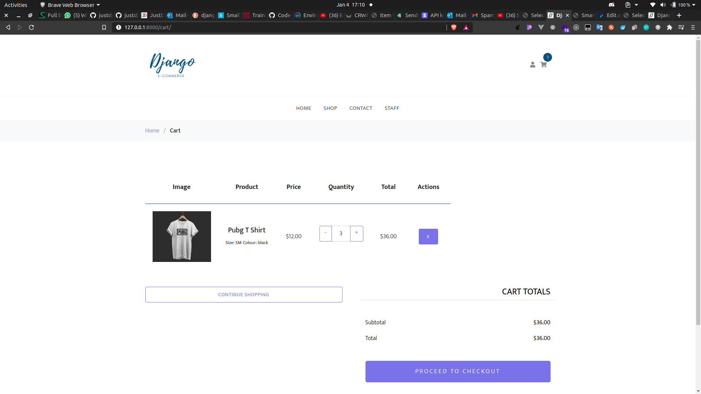

# Running the app locally.

### Prerequisites:

- you need docker installed on your computer.
- You also need docker-compose

## Start the app

```bash
docker-compose up
```

# Screenshots


<br/>


<br/>


<br/>


<br/>


<br/>


